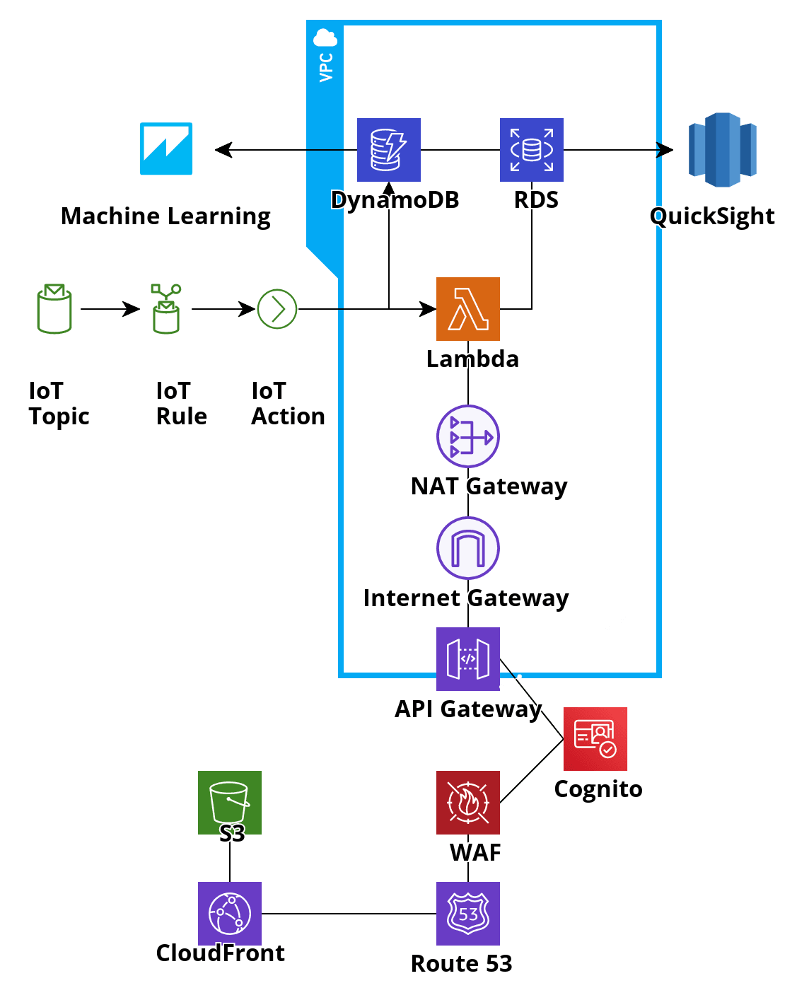

# Pragma Test

Considerando lo establecido por las diferentes capas de arquitectura a continuación presento
las capas de negocio, aplicación e infraestructura.

## Negocio y Aplicación

En la capa de negocio se plantearán los servicios y procesos de negocio. En el siguiente diagrama,
se presenta los diferentes procesos, actores y servicios involucrados.

Se puede identificar 3 funciones de negocio principales:

- Servicio de Monitoreo. Servicio de negocio principal, permite adquirir
  los dispositivos para hacer el monitoreo.
- Servicio de Detección de Anomalías. Este servicio es usado por los conductores
  cuando tienen un inconveniente.
- Servicio de Visualización de Estadísticas. Este servicio es usado por los 
  clientes para acceder a reportes y dashboard. 

En el diagrama, se describe la línea principal del proceso
para la adquisición del servicio. Considerando los procesos de negocio,
se proponen las siguientes aplicaciones como servicio:

- Servicio de Verificación de Identidad. En este caso, me inclinaría por adquirir
  un servicio de un tercero o una compañia especializada, ejemplo (Truora).
- Servicio de Comunicación de Sensores. Utilizaría técnicas de 
  internet de las cosas (IoT) para recuperar y obtener la información de los sensores,
  camaras y demás dispositivos involucrados para recuperar la información. Probablemente,
  se tendría que desarrollar algunas porciones de código para recolectar datos y pasarlos
  a una capa de persistencia.
- Servicio de Detección de Anómalias. Considero que no es suficiente que el conductor 
  deba presionar el botón de peligro para indicar si tiene un inconveniente. Podríamos
  implementar Sistemas Detectores de Anómalias basados en Inteligencia Artificial, para
  evaluar los casos en los que paradas no programadas o tomar rutas alternas signifiquen un
  peligro.
- Servicio para Presentación de Reportes. Aprovecharía herramientas de BI para visualizar
  en tableros de control la información recolectada por los dispositivos.
- Servicio para Administración de Ventas. Aplicativo para la gestión de clientes y contratos.
  Se va a suponer que se necesita un desarrollo.

## Infraestructura

Considerando las necesidades de aplicación, a continuación se evidencian los servicios que
utilizaría usando AWS para soportarlos.

En el diagrama, se pueden apreciar los siguientes servicios:
- S3. Este servicio se encarga de almacenar los siguientes datos:
  - Los videos capturados por las camaras en los vehiculos. 
  - Información de negocio como copias digitales de contratos, fotos de los clientes, etc. 
  - Front del aplicativo para la gestión de ventas.
- CDN. Permite conectar el contenido de S3 y exponerlo.
- IoT. Comunica cada uno de los dispositivos en el vehiculo y la base central de información.
- Lambda. Este servicio se encarga de:
  - Transformar los datos enviados por los dispositivos de IoT y persistirlos en la capa
    de datos. 
  - Exponer algunas API's usadas por el servicio de administración de ventas.
- DynamoDB. Persiste los datos enviados por los dispositivos de IoT.
- RDS. Persiste información relacional del negocio, como los datos de contacto de los clientes.
- Quicksight. Usado para la visualización de los datos almacenados en la capa de datos. Convierte
  los datos a información y brinda la posibilidad de visualizarlos en tiempo real.
- Machine Learning. Usado para desarrollar sistemas detectores de anomalías capaces de identificar
  si un conductor necesita ayuda.
- NAT Gateway, Internet Gateway. Permite el establecimiento de redes privadas con acceso a internet,
  para mejorar la latencia entre Lambda y RDS.
- API Gateway. Expone el contenido de Lambda a través del protocolo HTTPS. Usado para el backend del
  aplicativo.
- Cognito. Permite la autenticación y autorización para el uso de servicios.
- WAF. Firewall para la protección de servicios. (Backend y Frontend)
- Route53. Administración de dominios.

Considerando que los servicios presentados son complementamente serverless y orientados a
microservicios, considero que la plataforma está en la capacidad de recibir la carga esperada, 
ya que es completamente elastica.